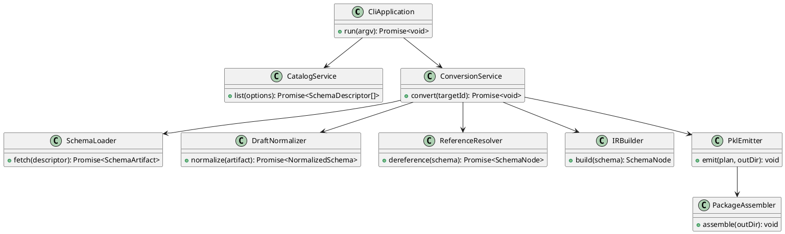
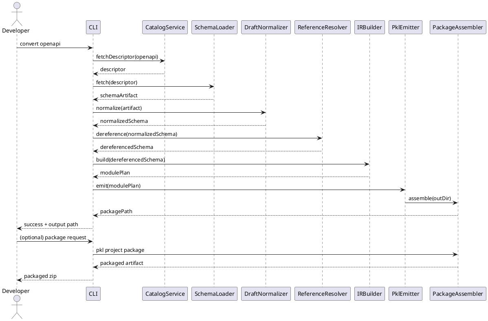

<!--
 Copyright 2025 Shuai Zhang
 SPDX-License-Identifier: LGPL-3.0-or-later WITH LGPL-3.0-linking-exception
-->

# SchemaStore JSON Schema → Apple Pkl 生成器设计文档

## 1. 背景与目标

SchemaStore 聚合了上百份社区维护的 JSON Schema。目标是编写一个 TypeScript CLI，将指定 schema（含依赖）转换成 Apple Pkl 模块与包（PklProject + 产出模块），使 Pkl 用户能够像使用 `pkg.pkl-lang.org/pkl-pantry/org.openapis.v3` 等现有 pantry 套件一样直接 import 并渲染配置。核心目标：

- 自动下载/解析 SchemaStore catalog 中的 schema（含 `$ref` 链接）。
- 统一不同 JSON Schema 草案（Draft‑04、06、07、2019‑09、2020‑12），在必要时通过迁移工具（`json-schema-migrate` 系列）收敛到 Draft‑07 再进入统一 IR（参见 `doc/investigation/json-schema-edition-relationship.md`、`json-schema-upgrade-migration.md`）。
- 将 JSON Schema 子集映射为 Pkl 的 typed object / listing / mapping / type constraints（参考 [Pkl Language Reference](https://pkl-lang.org/main/current/language-reference/index.html) 中的 typed objects、`Listing`、`Mapping`、type constraints 等小节）。
- 产出可发布的 Pkl package（含 `PklProject`、`output` 渲染配置），借鉴 pantry 中的 [`org.json_schema`](https://pkl-lang.org/package-docs/pkg.pkl-lang.org/pkl-pantry/org.json_schema/current/index.html) 与 [`org.openapis.v3`](https://pkl-lang.org/package-docs/pkg.pkl-lang.org/pkl-pantry/org.openapis.v3/current/index.html) 的结构。
- 以 `example/openapis-3-0.json` 为端到端基线，保证生成包与官方 OpenAPI pantry 在结构与校验能力上对齐。

非目标：

- 不尝试支持 JSON Schema 所有关键字（如 `unevaluatedProperties`, `application/json`-specific vocabularies）。高级特性将通过 fallback（Doc comment + runtime 校验 stub）暴露。
- 不在首版内实现反向 Pkl → JSON Schema 生成。

## 2. 约束与外部依赖

- **语言与运行时**：Node.js 22+、TypeScript 5.9，沿用现有脚手架与 Biome/Vitest/tsup。
- **JSON Schema 处理**：使用 `@hyperjump/json-schema`（多草案解析）与 `json-schema-migrate`（Draft‑04→07 迁移）。必要时可引入 `json-schema-ref-parser` 做 `$ref` bundling。
- **Pkl 特性**：依赖 typed object、`Listing`/`Mapping` default、type constraints、`output` 与 `PklProject`（参照 Pkl Language Reference“Objects/Typed Objects”“Listings”“Mappings”“Projects”等章节）。
- **包格式**：遵循 `pkl:Project` 约定（manifest、dependencies、`packageZipUrl` 等），保证后续可执行 `pkl project package`。

## 3. 范围

| 必须实现         | 说明                                                                                                          |
| ---------------- | ------------------------------------------------------------------------------------------------------------- |
| Catalog sync     | 解析 SchemaStore catalog，建立 `SchemaDescriptor` 列表（可复用 `src/ts/src/index.ts` 的 descriptor helper）。 |
| Schema ingestion | 下载 schema、本地缓存、根据 `$schema` 字段决定解析策略。                                                      |
| 草案归一化       | Draft‑04/06 自动迁移到 Draft‑07，保留 2019‑09/2020‑12 原语，并在 IR 中统一。                                  |
| `$ref` 解析      | 支持相对/绝对 URI、#pointer、循环检测。                                                                       |
| Pkl IR + 生成    | 定义中间表示，输出 typed class/module、`Mapping`、注释、`output` renderer。                                   |
| 包装/发布工序    | 生成 `PklProject`、多文件输出布局、zip 目标。                                                                 |
| 测试             | Vitest 单测 + fixture schema 集成测试 + OpenAPI 端到端对比。                                                  |

可选增强：并行下载、多草案混合项目、`if/then/else`→运行时校验 helper、增量更新。

## 4. 总体架构

```text
                ┌───────────────────────────┐
                │   CLI (cac/commander)     │
                └────────────┬──────────────┘
                             │
          ┌──────────────────┴──────────────────┐
          │                                     │
┌────────────────────┐               ┌─────────────────────┐
│CatalogService      │               │ConversionService    │
│- fetch catalog     │               │- load schema        │
│- filter descriptor │               │- normalize drafts   │
└─────────┬──────────┘               │- resolve $ref       │
          │                          │- emit IR            │
          ▼                          │- render Pkl modules │
┌────────────────────┐               └─────────┬───────────┘
│SchemaCache         │                         │
└─────────┬──────────┘                         ▼
          │                          ┌─────────────────────┐
          │                          │PackageAssembler     │
          │                          │- write PklProject   │
          │                          │- structure outputs  │
          │                          │- zip/sign artifacts │
          │                          └─────────────────────┘
```

数据流：CLI 根据用户命令读取 catalog → 获取 schema → 生成 IR → 渲染 Pkl 模块 → 写入包结构（`pkg/`, `modules/`, `PklProject` 等）。

## 5. 组件设计

### 5.1 CLI

- 采用 `cac`（零依赖）或 `commander`，提供子命令：
    - `catalog list [--tag lint]`：打印 SchemaStore 列表。
    - `convert <schema-id> --out <dir> [--draft <target>]`：核心转换命令。
    - `package <dir>`：将已有生成物打包（可合并到 `convert` 的 `--package` 选项）。
- 负责解析 flags（如 `--include-descriptions`, `--max-depth`），并将配置传给 services。

### 5.2 CatalogService

- 读取 `https://www.schemastore.org/api/json/catalog.json`，使用当前 `SchemaDescriptor` helper 生成 typed view。
- 支持 `fileMatch`, `tags`, `versions` 过滤。
- 内置缓存与 ETag 以减少网络请求。

### 5.3 SchemaLoader & Cache

- 接收 descriptor，下载 schema 文件（HTTP + 本地 fallback）。
- 归档到 `.schemastore-cache/<id>/<version>.json`，哈希校验避免重复下载。

### 5.4 DraftNormalizer

- 根据 `$schema` 判断草案：
    - Draft‑04/06 → 通过 `json-schema-migrate` 转成 Draft‑07。
    - 07/2019-09/2020-12 → 原样输入 IR，但会记录差异（`$defs` vs `definitions`）。
- 记录迁移日志，供最终包注释说明“源草案/迁移路径”。

### 5.5 ReferenceResolver

- 使用 `json-schema-ref-parser` 或自研 DFS：
    - 支持相对路径、HTTP 远程、内部 `#` pointer。
    - 检测循环 `$ref`，在 IR 中转成 `AliasNode` 并在 Pkl 端生成 `typealias`。
    - 输出“去引用”树 + 依赖图数据用于顺序化生成。

### 5.6 Intermediate Representation (IR)

- `SchemaNode`（联合类型）
    - `ScalarNode`（string/integer/number/boolean/null + constraints）
    - `ObjectNode`（properties, required, additionalProperties/patternProperties, unevaluated markers）
    - `ArrayNode`（items/tupleItems, min/max, unique）
    - `EnumNode` / `ConstNode`
    - `CombinationNode`（allOf/anyOf/oneOf/not）
    - `ReferenceNode`（指向共享定义，以便创建 Pkl class/typealias）
- 附加 metadata：`title`, `description`, `examples`, `default`, `deprecated`, `readOnly/writeOnly`。

### 5.7 PklEmitter

- 映射规则：
    - Object → `class <Name>`（properties + type constraints）。`required` → 非可空属性；可选字段 → `T?` + 默认 `Null(T default)`；
      `additionalProperties` schema → `Mapping<String, ValueType>`；`patternProperties` → `Mapping<String,Value>(keysMatchRegex)`。
    - Array → `Listing<ElementType>` + `isDistinct`（`uniqueItems=true`）、`length` 约束（`minItems`/`maxItems`）。
    - Scalar constraint → Pkl type constraints（`String(length >= n)`, `Int(isBetween(min,max))` 等，参见 Language Reference
      “Type Annotations / Type Constraints”）。
    - Enum/const → 字面量 union 或 typealias（`typealias Level = "debug"|"info"|"warn"|"error"`）。
    - Combination：
        - `allOf` → class 继承链（Pkl 支持单继承）+ mixin traits；若冲突则生成组合验证函数。
        - `oneOf`/`anyOf` → sealed union（通过 Pkl `typealias` + `oneOf` 注释）+ runtime validator helper。
        - `not` → 暂时以 doc comment + runtime 断言表示。
    - `examples`/`default` → 映射到 attribute comment 与字段默认值。
    - 额外 helper：`validateOneOf(objects)`、`assertPatternProperty` 等，放在 `module validators`。

### 5.8 PackageAssembler

- 输出结构：
    - `modules/<schemaName>/types.pkl`：主 typed objects。
    - `modules/<schemaName>/validators.pkl`：组合/高级约束 helper。
    - `modules/<schemaName>/renderers.pkl`：可选，方便 `output {}`。
    - `PklProject`：声明 package metadata（`name`, `version`, `dependencies`）。
- 根据 `org.openapis.v3` pantry 的模式添加 `examples/`、`tests/`，并生成 README（含来源链接、草案信息、原始 schema 哈希）。
- 若用户指定 `--package`, 自动调用 `pkl project package`（或提示命令）。

## 6. 数据模型与命名

| 实体               | 说明                                                      |
| ------------------ | --------------------------------------------------------- |
| `SchemaDescriptor` | catalog 中的 schema 元数据（id、name、url、aliases）。    |
| `SchemaArtifact`   | 下载后的 schema 文本 + metadata（etag、draft）。          |
| `NormalizedSchema` | 迁移后的 JSON，对应 Draft‑07+ 语义。                      |
| `SchemaNode`       | IR node（参见 5.6）。                                     |
| `PklModulePlan`    | 单个 schema 输出的模块拆分（main/validators/renderers）。 |

命名规则：

- Typed class 名字从 `title` 或 `SchemaDescriptor.name` 推导，转 PascalCase。冲突时追加后缀（`Foo`, `Foo2`）。
- 属性名从 JSON property 原样使用，若非合法 Pkl identifier（含 `-`）则转成 camelCase 并记录 `@jsonKey("original")` 注释。

## 7. JSON Schema → Pkl 关键映射

| JSON Schema                     | Pkl 表达                                         | 备注                                                    |
| ------------------------------- | ------------------------------------------------ | ------------------------------------------------------- |
| `type: "object"` + `properties` | `class` + `property` 定义                        | required → 非可空，optional → `?`.                      |
| `additionalProperties: false`   | `type constraints { disallowExtraKeys() }`       | 使用 Pkl constraint helper。                            |
| `patternProperties`             | `Mapping<String, Value>(keysMatchRegex("^foo"))` | Regex 需转成 Pkl `Regex`.                               |
| `dependencies` (property)       | 生成 validator 函数                              | doc 中说明限制。                                        |
| `type: ["string","null"]`       | `String?`                                        | 允许 null → 可空。                                      |
| `format`                        | doc comment + 可选验证 helper                    | 例如 `format: "date-time"` → `validateDateTime(field)`. |
| `const`                         | 字面量默认值 + 类型限制                          | `const: 3` → `Int(isExactly(3))`.                       |
| `enum`                          | `typealias` or `sealed interface`                | 结合 `Mapping` 生成 union。                             |
| `oneOf`                         | union + runtime validator                        | 需对每个备选类型命名。                                  |
| `allOf`                         | 多基类/mixins                                    | 继承+合并属性。                                         |
| `default`                       | 字段默认值                                       | 仅在 schema 合理时设置（避免复杂对象 deep copy）。      |

## 8. 高级特性处理策略

- **条件 schema (`if/then/else`)**：转换成 validator helper，输出 doc comment，并在 `validators.pkl` 中生成函数 `validateConditional(root)`。
- **`unevaluated*` 关键字**：记录到 doc comment + 生成 `TODO` 级别告警，未来版本再处理。
- **`contentEncoding`/`contentMediaType`**：生成注释，提醒用户自定义 constraint。
- **`readOnly`/`writeOnly`**：用于生成 `@note` 注释和 renderer hints。
- **`examples`**：写入 `examples/<name>.pkl`，可在 README 中引用。
- **`definitions`/`$defs`**：统一装载到 `DefinitionsRegistry`，在 Pkl 中生成 `module definitions { ... }`。

## 9. 包装与发布流程

1. 生成目录：`out/<schema-id>/`。
2. 写入：
    - `PklProject`（name = `pkg.schemastore.<id>`, version=来自 catalog/用户输入）。
    - `modules/`：类型、validator、renderer。
    - `examples/`：from schema `examples` or curated set。
    - `README.md`：说明来源、草案、生成日期、命令。
3. 若用户开启 `--package`, 调用 `pkl project package --output dist/`。
4. 可以附带 `checksums.json`，存储原始 schema URL + SHA256 供后续 diff。

## 10. 文本化图示

### 10.1 类图（文字描述）

```text
class CliApplication {
  +run(argv): Promise<void>
}

class CatalogService {
  +list(options): Promise<SchemaDescriptor[]>
}

class SchemaLoader {
  +fetch(descriptor): Promise<SchemaArtifact>
}

class DraftNormalizer {
  +normalize(artifact): Promise<NormalizedSchema>
}

class ReferenceResolver {
  +dereference(schema): Promise<SchemaNode>
}

class IRBuilder {
  +build(node): PklModulePlan
}

class PklEmitter {
  +emit(plan, targetDir): Promise<void>
}

CliApplication --> CatalogService
CliApplication --> ConversionService
ConversionService --> SchemaLoader
ConversionService --> DraftNormalizer
ConversionService --> ReferenceResolver
ConversionService --> IRBuilder
ConversionService --> PklEmitter
```

#### PlantUML



### 10.2 序列图（文字描述）

1. 开发者执行 `pnpm tsx src/ts/src/index.ts convert openapi`。
2. CLI 解析参数，调用 CatalogService 获取目标 descriptor。
3. SchemaLoader 下载 schema 并写入缓存。
4. DraftNormalizer 依据 `$schema` 迁移草案。
5. ReferenceResolver 展开 `$ref`，输出依赖图。
6. IRBuilder 构建 `SchemaNode` 拓扑。
7. PklEmitter 渲染模块，PackageAssembler 写入项目结构。
8. CLI 输出产物路径，并可选触发 `pkl project package`。

#### PlantUML



### 11.1 Schema ingestion

1. 从 CatalogService 获取 descriptor。
2. 构造下载 URL（若 descriptor 有 `versions`, 选择 `latest` 或 `--version` 指定）。
3. 下载 JSON（支持 gzip）。
4. 验证 SHA256/ETag，写入 cache。
5. 将 `SchemaArtifact` 传给 DraftNormalizer。

### 11.2 Draft normalization

1. 解析 `$schema`（若缺失则根据 catalog metadata 猜测）。
2. 对 Draft‑04/06 使用 `json-schema-migrate`。
3. 对 2019‑09/2020‑12，统一 `$defs` → `definitions` 表示。
4. 记录迁移日志（list of transformations）。
5. 输出 `NormalizedSchema`。

### 11.3 IR 构建

递归 DFS：

```text
function toNode(json): SchemaNode {
  if ($ref) return registerReference(json.$ref)
  switch json.type or keywords:
    case "object": return buildObjectNode(json)
    case "array": return buildArrayNode(json)
    case "string"|"number"|...: return buildScalar(json)
    default:
      if (anyOf/oneOf/allOf) return buildCombination(json)
      if (enum) return buildEnum(json)
}
```

对象节点额外收集：`required`, `propertyOrder`, `dependencies`, `patternProperties`。

### 11.4 Pkl emission

1. 对 IR 进行拓扑排序（确保依赖在前）。
2. 对每个 ObjectNode 生成 class，字段注入 type constraint。
3. 对 ArrayNode 生成 `Listing` 或 `typealias`。
4. 对 Combination 生成 validator helper + union type。
5. 渲染模板（使用 `mustache` 或 `eta`），写入 `modules/`。
6. 追加 README、PklProject、examples。

## 12. 测试计划

| 层级     | 内容                                                                                          | 工具                          |
| -------- | --------------------------------------------------------------------------------------------- | ----------------------------- |
| 单元测试 | DraftNormalizer、ReferenceResolver、IRBuilder 的纯函数                                        | Vitest + fixture JSON         |
| 集成测试 | `pnpm test --filter conversion`，使用多草案 schema                                            | Vitest + snapshot（Pkl 输出） |
| 端到端   | `pnpm test --filter e2e`，基于 `example/openapis-3-0.json` 与 pantry `org.openapis.v3` 对比   | Vitest + `pkl eval`           |
| 回归     | 选取 SchemaStore 热门 schema（tsconfig, package.json, renovate, turbo.json 等），确保命令成功 | GitHub CI matrix              |

CI 流程：`pnpm lint` → `pnpm build` → `pnpm test`。附加工作流可运行 `pkl lint` 检查产物语法。

## 13. 风险与缓解

| 风险             | 描述                                             | 缓解                                                    |
| ---------------- | ------------------------------------------------ | ------------------------------------------------------- |
| 草案混用         | 同一 schema 引用不同草案子 schema                | 在 ReferenceResolver 中记录 `$schema`，必要时局部迁移。 |
| `$ref` 深度/循环 | 复杂 schema（OpenAPI）容易出现循环               | 使用图检测，生成 typealias。                            |
| Pkl 特性缺失     | 例如 `not`, `unevaluatedProperties` 难以直接表达 | 暂用 runtime validator + 文档标注。                     |
| 性能             | 大 schema（OpenAPI, Azure ARM）解析耗时          | 引入缓存、并发下载、IR memoization。                    |
| Pkl 语言演进     | 未来版本可能引入新语法                           | 通过 `pkg.pkl-lang.org` 版本 pin（`languageVersion`）。 |

## 14. 里程碑与下一步

1. **M1**：完成 CatalogService / SchemaLoader，提供 `catalog list`。
2. **M2**：实现 DraftNormalizer + ReferenceResolver + IRBuilder，配套单测。
3. **M3**：完成 PklEmitter + PackageAssembler，生成最小 demo（tsconfig）。
4. **M4**：端到端 OpenAPI 生成，与 pantry 结果对比，补齐 README/validators。
5. **M5**：CLI polish（flags、packaging），发布 alpha。

## 15. 参考资料

- Schema 草案与迁移：`doc/investigation/json-schema-edition-relationship.md`, `json-schema-upgrade-migration.md`。
- Pkl 官方文档：Pkl Language Reference、Pkl Reference Library、`org.json_schema`/`org.openapis.v3` pantry 页面。
- 示例 schema：`example/openapis-3-0.json`（2024‑10‑18 版本）。
