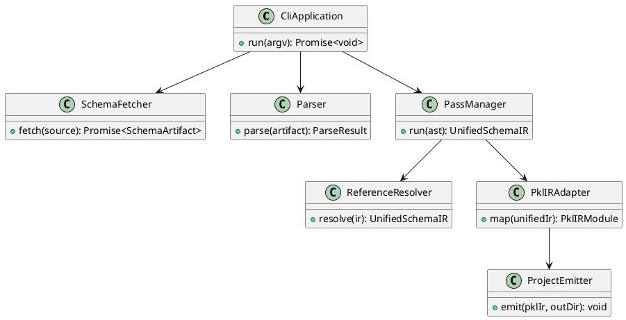
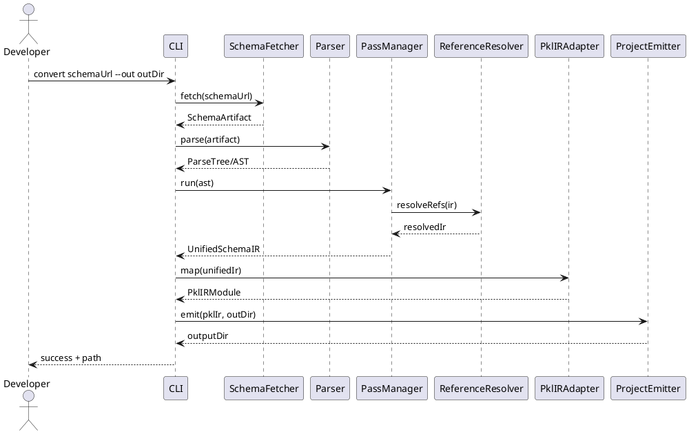

<!--
 Copyright 2025 Shuai Zhang
 SPDX-License-Identifier: LGPL-3.0-or-later WITH LGPL-3.0-linking-exception
-->

# JSON Schema → Apple Pkl 生成器设计文档

## 1. 背景与目标

本项目面向“任意符合 Draft‑07 / 2019‑09 / 2020‑12 规范的 JSON Schema 文档”，不绑定特定来源。目标是构建一个 TypeScript 编写的转换器，接收外部提供的 schema URL 或本地路径，将其逐步转换成 Apple Pkl 包工程（`PklProject` + 模块 + 示例文件），供下游直接 import 使用。核心目标：

- 支持 Draft‑07、2019‑09、2020‑12 三个草案，保证其组合 `$ref`/`$defs`/vocabulary 均可解析并被统一映射；Draft‑04/06 可选通过迁移工具过渡，但不作为主线要求。
- 将 JSON Schema 解析为语法树并经由 **nanopass 风格** 的 AST 转换序列，逐步归约到统一的逻辑 IR，再映射到 Apple/Pkl 的 IR（参考 [tree-sitter-pkl](https://github.com/apple/tree-sitter-pkl) 对语法元素的定义）。
- 生成结构化的 Pkl 工程：多模块 typed objects、validators、渲染示例和 README，满足 `pkl project` 工具链，便于后续在任意分发渠道发布。
- 仍以 `example/openapis-3-0.json` 作为端到端示例，确保对主流 schema（如 OpenAPI 3.x）可以落地，同时保证对任何同草案 schema 的普适性。

非目标：

- 不尝试支持 JSON Schema 所有关键字（如 `unevaluatedProperties`, `application/json`-specific vocabularies）。高级特性将通过 fallback（Doc comment + runtime 校验 stub）暴露。
- 不在首版内实现反向 Pkl → JSON Schema 生成。

**验收标准**：需要证明转换器能够成功处理 SchemaStore 中的代表性 schema，但实现上不依赖 SchemaStore 特有功能。

## 2. 约束与外部依赖

- **语言与运行时**：Node.js 22+、TypeScript 5.9，沿用现有脚手架与 Biome/Vitest/tsup。
- **JSON Schema 处理**：使用 `@hyperjump/json-schema`（多草案解析）与 `json-schema-migrate`（Draft‑04→07 迁移）。必要时可引入 `json-schema-ref-parser` 做 `$ref` bundling。
- **Pkl 特性**：依赖 typed object、`Listing`/`Mapping` default、type constraints、`output` 与 `PklProject`（参照 Pkl Language Reference“Objects/Typed Objects”“Listings”“Mappings”“Projects”等章节）。
- **包格式**：遵循 `pkl:Project` 约定（manifest、dependencies、`packageZipUrl` 等），保证后续可执行 `pkl project package`。

## 3. 范围

| 必须实现             | 说明                                                                                                        |
| -------------------- | ----------------------------------------------------------------------------------------------------------- |
| Schema 获取          | 从调用者提供的 URL/本地路径拉取 JSON Schema，内置缓存与校验（无需 catalog 列表或 descriptor 过滤逻辑）。    |
| Parsing / AST        | 解析 schema JSON，保留注释/定位信息，形成 Parsing Tree 与初始 AST，便于后续 pass 操作。                     |
| 草案归一化           | 针对 Draft‑07/2019‑09/2020‑12 统一语义，必要时对 Draft‑04/06 作可选迁移，保持 `$defs`/`definitions` 一致。  |
| `$ref` / 依赖解析    | 支持相对/绝对 URI、`$anchor`、`$dynamicRef` 等解析，构建依赖图并检测循环。                                  |
| Nanopass AST→IR 管线 | 以 nanopass 思想拆分若干 Pass（如 keyword desugaring、type lifting、constraint lowering），每一步验证 IR。  |
| Apple/Pkl IR 适配    | 将统一 IR 转换成 Apple/Pkl IR（参考 tree-sitter-pkl 语法元素），补充 typed objects、validators、renderers。 |
| 工程生成             | 输出多文件 Pkl 工程（`PklProject`、`modules/`、`examples/`、README），不负责 zip/package 打包。             |
| 测试                 | Vitest 单测 + fixture schema 集成测试 + OpenAPI 端到端对比。                                                |

可选增强：并行下载、多草案混合项目、`if/then/else`→运行时校验 helper、增量更新、对 Draft‑04 自动迁移。

## 4. 总体架构

```text
┌─────────────────────────┐
│ CLI / API Entrypoint    │  (接受 schema URL、本地路径、输出目录)
└──────────────┬──────────┘
       │ config + source
  ┌────────▼─────────┐
  │ SchemaFetcher    │  (HTTP/file, 缓存+校验)
  └────────┬─────────┘
       │ raw JSON
  ┌────────▼─────────┐
  │ Parser           │  (Parsing Tree + 初始 AST)
  └────────┬─────────┘
       │ AST
  ┌────────▼─────────┐
  │ PassManager      │  (Nanopass pipeline)
  │  - draft normal  │
  │  - $ref resolve  │
  │  - keyword lower │
  │  - constraint IR │
  └────────┬─────────┘
       │ Unified IR
  ┌────────▼─────────┐
  │ Pkl IR Adapter   │  (映射到 Apple/Pkl IR, 参考 tree-sitter-pkl)
  └────────┬─────────┘
       │ Pkl IR modules
  ┌────────▼─────────┐
  │ ProjectEmitter   │  (写多文件 PklProject, modules, examples)
  └──────────────────┘
```

数据流（与 Debug Profile 下的 IL 校验）：

1. 获取 schema：调用方提供 URL/路径，`SchemaFetcher` 负责下载、缓存、哈希校验。
2. 解析 schema：`Parser` 生成 Parsing Tree + AST，保留源位置信息，便于错误报告。
3. Nanopass AST 变换：`PassManager` 将 AST 通过多个 pass（draft unification、`$ref` 展开、组合关键字 desugar、type lifting 等）逐步转化为统一 IR；在 Debug 配置下，每个 pass 前后运行 IL 验证器，确保结构不被破坏。
4. Apple/Pkl IR：`Pkl IR Adapter` 将统一 IR 映射到 Apple/Pkl IR（Node/Class/Constraint 表达），遵循 tree-sitter-pkl 的语法节点定义，补完 typed objects、validators、renderers。
5. 工程生成：`ProjectEmitter` 根据 Pkl IR 写入 `PklProject`、`modules/*.pkl`、`examples/`、`README.md` 等多文件输出，供用户直接 `pkl project` 使用（无需在此阶段打包 zip）。

## 5. 组件设计

### 5.1 CLI / API Entrypoint

- 使用 `cac` 或 `commander` 提供 `convert <schema-url> --out <dir>` 等命令，也可以暴露 JS API，方便外部驱动。
- 负责解析输出目录、生成模式（release/debug）、schema 来源（HTTP、本地、stdin），并将统一配置交给管线。
- Debug Profile 下会开启 pass-level tracing 与 IL 验证；Release 则关闭冗余检查以提升吞吐。

### 5.2 SchemaFetcher

- 接收 schema URL/路径，支持 HTTP(S)、文件系统和 data URI。
- 处理 ETag/Last-Modified，缓存到 `.schema-cache/<hash>.json`，并记录 SHA256 以供后续 README/验证输出。
- 对 HTTP 错误、内容类型异常进行分类报错，提供重试/离线缓存 fallback。

### 5.3 Parser

- 基于 `jsonc-parser` 或 `json-ast` 解析 schema，生成 Parsing Tree，保留节点范围（offset/line/column）。
- 构造初始 AST（接近原 schema 结构），附带 `SourceLocation`，供 pass 在报错时引用。
- Parser 负责最基础的结构检查（JSON 语法、重复键），语义交给后续 pass。

### 5.4 PassManager（Nanopass Pipeline）

- 以 nanopass 思想组织若干独立 pass，每个 pass 只处理一个语义点，示例：
    1. **DraftNormalizationPass**：识别 `$schema`，在 Draft‑04/06 时调用 `json-schema-migrate`，统一 `$defs` 表示。
    2. **RefResolutionPass**：解析 `$ref`/`$dynamicRef`，构建依赖图与 memoized 节点。
    3. **CombinationDesugarPass**：将 `allOf`/`anyOf`/`oneOf`/`not` 降级为 constraint IR。
    4. **TypeLiftingPass**：将 `type` 联合、`const`、`enum` 规范化为 `ScalarNode` 或 `EnumNode`。
    5. **ConstraintLoweringPass**：把 `minLength`、`pattern`、`dependentSchemas` 等转成统一 constraint 表达。
- PassManager 维护 `PassContext`，在 Debug Profile 下对 pass 输入/输出运行结构化验证器（shape/graph checks），并输出 trace。

### 5.5 ReferenceResolver（作为 Pass）

- 负责 `$ref`、`$recursiveRef`、`$anchor`、`$dynamicRef` 的解析，支持绝对/相对 URI。
- 检测循环并生成 `AliasNode`，确保在 Pkl 侧通过 typealias/forward declaration 处理。
- 输出拓扑排序结果，供后续 Pass/Pkl IR 生成确定顺序。

### 5.6 Intermediate Representation (IR)

- Nanopass 的产物是 **UnifiedSchemaIR**，核心节点：
    - `ScalarNode`（string/integer/number/boolean/null + constraints）
    - `ObjectNode`（properties, required, patternProperties, additional semantics, unevaluated markers）
    - `ArrayNode`（items/tupleItems, min/max, unique, contains）
    - `EnumNode` / `ConstNode`
    - `CombinationNode`（逻辑组合已转为 constraint graph，但仍保留来源信息）
    - `ReferenceNode`（指向共享定义 + 解析好的 target）
- 附加 metadata：`title`, `description`, `examples`, `default`, `deprecated`, `readOnly/writeOnly`, `sourceLocation`。
- IR 验证器会在 Debug Profile 中检查：节点引用闭合、constraint 范围合法、无 dangling ref。

### 5.7 Pkl IR Adapter

- 依据 Apple/Pkl IR（参照 tree-sitter-pkl 的语法节点）构建 `PklModule`, `PklClass`, `PklTypeAlias`, `Constraint` 等结构。
- 映射规则：
    - Object → `class <Name>`，`required` → 非可空属性，可选 → `T?` + 默认值；`additionalProperties` → `Mapping<String, ValueType>`。
    - Array → `Listing<ElementType>`，`uniqueItems` → `isDistinct`, `minItems/maxItems` → 长度 constraint。
    - Scalar constraint → type constraint，如 `String(length >= n)`、`Int(isBetween(min,max))`。
    - Enum/const → 字面量 union 或 `typealias`。
    - 组合关键字 → sealed union + validator helper。
- Adapter 还会生成 validator/renderer 模块骨架，方便在 Pkl 中集中放置 runtime 检查。

### 5.8 ProjectEmitter

- 将 Pkl IR 写成多文件：`PklProject`、`modules/<schemaName>/types.pkl`、`modules/<schemaName>/validators.pkl`、`examples/*.pkl`、`README.md`。
- README 写入来源 URL、草案、SHA256、生成命令，方便后续人工审核与追踪。
- 支持输出布局模板定制（如单模块/多模块），但**不**在本工具中打包 zip；如需发布可由用户后续调用 `pkl project package`。

## 6. 数据模型与命名

| 实体               | 说明                                                                       |
| ------------------ | -------------------------------------------------------------------------- |
| `SchemaSource`     | 输入参数组合（URL/路径、etag、hash、下载时间），供 README 与缓存索引使用。 |
| `SchemaArtifact`   | 获取后的原始 JSON 文本及解析到的草案、content-type。                       |
| `ParseTree`        | JSON Parser 输出，包含节点范围信息。                                       |
| `InitialAST`       | Parser 归一后的 AST（保留与原 schema 接近的结构）。                        |
| `UnifiedSchemaIR`  | Nanopass 管线输出的统一 IR（见 5.6）。                                     |
| `PklIRModule`      | Apple/Pkl IR 表示，包含 typed classes、typealias、validators、renderers。  |
| `ModuleLayoutPlan` | 确定哪些 IR 节点写入哪个 Pkl 文件（types/validators/examples）。           |

命名规则：

- Typed class 名字优先取 `title`，否则基于 schema 文件名或 `$id` 推导，再转 PascalCase；冲突时追加序号（`Foo`, `Foo2`）。
- 属性名沿用 JSON property，若包含非法字符则 camelCase 化并记录 `@jsonKey("original")` 注释。
- 模块目录名使用规范化的 schema 名称（例如 `openapi3`, `tsconfig`），并在 README 中写明原始来源。

## 7. JSON Schema → Pkl 关键映射

| JSON Schema                     | Pkl 表达                                         | 备注                                                    |
| ------------------------------- | ------------------------------------------------ | ------------------------------------------------------- |
| `type: "object"` + `properties` | `class` + `property` 定义                        | required → 非可空，optional → `?`.                      |
| `additionalProperties: false`   | `type constraints { disallowExtraKeys() }`       | 使用 Pkl constraint helper。                            |
| `patternProperties`             | `Mapping<String, Value>(keysMatchRegex("^foo"))` | Regex 需转成 Pkl `Regex`.                               |
| `dependencies` (property)       | 生成 validator 函数                              | doc 中说明限制。                                        |
| `type: ["string","null"]`       | `String?`                                        | 允许 null → 可空。                                      |
| `format`                        | doc comment + 可选验证 helper                    | 例如 `format: "date-time"` → `validateDateTime(field)`. |
| `const`                         | 字面量默认值 + 类型限制                          | `const: 3` → `Int(isExactly(3))`.                       |
| `enum`                          | `typealias` or `sealed interface`                | 结合 `Mapping` 生成 union。                             |
| `oneOf`                         | union + runtime validator                        | 需对每个备选类型命名。                                  |
| `allOf`                         | 多基类/mixins                                    | 继承+合并属性。                                         |
| `default`                       | 字段默认值                                       | 仅在 schema 合理时设置（避免复杂对象 deep copy）。      |

## 8. 高级特性处理策略

- **条件 schema (`if/then/else`)**：转换成 validator helper，输出 doc comment，并在 `validators.pkl` 中生成函数 `validateConditional(root)`。
- **`unevaluated*` 关键字**：记录到 doc comment + 生成 `TODO` 级别告警，未来版本再处理。
- **`contentEncoding`/`contentMediaType`**：生成注释，提醒用户自定义 constraint。
- **`readOnly`/`writeOnly`**：用于生成 `@note` 注释和 renderer hints。
- **`examples`**：写入 `examples/<name>.pkl`，可在 README 中引用。
- **`definitions`/`$defs`**：统一装载到 `DefinitionsRegistry`，在 Pkl 中生成 `module definitions { ... }`。

## 9. 工程输出流程

1. 生成目录：`out/<schema-name>/`。
1. 写入：
    - `PklProject`（默认名 `pkg.schemas.<slug>`，可由调用方覆盖）。
    - `modules/<schemaName>/types.pkl`, `validators.pkl`, `renderers.pkl`。
    - `examples/*.pkl`（基于 schema `examples` 或自定义样例）。
    - `README.md`：包含 schema URL、草案版本、SHA256、运行命令、限制说明。
    - `checksums.json`：记录源 schema URL + hash，辅助回归与评审。

1. 输出完成后返回目录路径；若调用方需要 zip，可在本工具外部自行 `pkl project package` 或打包。

## 10. 文本化图示

### 10.1 类图（文字描述）

```text
class CliApplication {
  +run(argv): Promise<void>
}

class SchemaFetcher {
  +fetch(source): Promise<SchemaArtifact>
}

class Parser {
  +parse(artifact): ParseResult
}

class PassManager {
  +run(ast): UnifiedSchemaIR
}

class ReferenceResolver {
  +resolve(ir): UnifiedSchemaIR
}

class PklIRAdapter {
  +map(unifiedIr): PklIRModule
}

class ProjectEmitter {
  +emit(pklIr, outDir): Promise<void>
}

CliApplication --> SchemaFetcher
CliApplication --> Parser
CliApplication --> PassManager
PassManager --> ReferenceResolver
PassManager --> PklIRAdapter
PklIRAdapter --> ProjectEmitter
```

#### PlantUML



### 10.2 序列图（文字描述）

1. 开发者执行 `pnpm tsx src/ts/src/index.ts convert <schema-url>`。
1. CLI 解析参数，构建 `SchemaSource`，传入 SchemaFetcher。
1. SchemaFetcher 下载/缓存 schema，返回 `SchemaArtifact`。
1. Parser 生成 Parsing Tree + AST。
1. PassManager 运行各 pass，期间 ReferenceResolver 展开 `$ref` 并在 Debug Profile 下触发 IR 验证。
1. 统一 IR 交给 PklIRAdapter，映射成 Apple/Pkl IR。
1. ProjectEmitter 根据 layout 写多文件 Pkl 工程，返回输出目录。
1. CLI 打印结果，供验收流程直接复现与比对。

#### PlantUML



### 11.1 Schema 获取

1. CLI 解析 `schemaUrl`/路径并生成 `SchemaSource`。
1. SchemaFetcher 判断协议（HTTP/file/data）并读取内容。
1. 计算 SHA256，若缓存命中则直接返回；否则写入缓存并返回 `SchemaArtifact`（含 `$schema`、etag、MIME）。

### 11.2 Parsing & AST 构建

1. Parser 读取 `SchemaArtifact` 文本，利用 `jsonc-parser` 生成 `ParseTree`。
1. 遍历 parse tree 构造 `InitialAST`，记录 `SourceLocation`。
1. 执行基础校验：重复键、非 JSON 语法、顶层必须为对象。

### 11.3 Nanopass 管线

1. PassManager 维护 pass 列表，按顺序运行：
    - DraftNormalizationPass：统一草案；必要时调用 `json-schema-migrate`。
    - RefResolutionPass：解析 `$ref`/`$dynamicRef`，生成依赖图。
    - CombinationDesugarPass：把 `allOf`/`anyOf`/`oneOf`/`not` 转成 constraint graph。
    - TypeLiftingPass：拆解 `type` 联合、`const`、`enum`。
    - ConstraintLoweringPass：将 `min*`、`pattern`、`dependentSchemas` 等映射为统一 constraint 表达。
    - MetadataPass：保留 `title`、`description`、`examples` 等。
1. Debug Profile：在每个 pass 前后运行 IR validator（结构完整性、引用闭合），并输出 diff/trace。
1. Pass 链输出 `UnifiedSchemaIR`，供 Adapter 使用。

### 11.4 Pkl IR 生成与项目写出

1. PklIRAdapter 遍历 `UnifiedSchemaIR`，按依赖拓扑排序生成 Apple/Pkl IR 节点。
1. 对 ObjectNode 生成类，对 ArrayNode 生成 `Listing`/typealias，对组合节点生成 sealed union + validator helper。
1. 将 `default`、`examples`、`description` 编织到属性注释/文档。
1. ProjectEmitter 根据 `ModuleLayoutPlan` 渲染模板（`eta`/`handlebars`），写入 `PklProject`、`modules/*.pkl`、`examples/`、`README.md`。
1. Debug Profile 可额外运行 `pkl eval --check` 验证语法，再返回输出目录。

## 12. 测试计划

| 层级     | 内容                                                                                        | 工具                          |
| -------- | ------------------------------------------------------------------------------------------- | ----------------------------- |
| 单元测试 | DraftNormalizer、ReferenceResolver、IRBuilder 的纯函数                                      | Vitest + fixture JSON         |
| 集成测试 | `pnpm test --filter conversion`，使用多草案 schema                                          | Vitest + snapshot（Pkl 输出） |
| 端到端   | `pnpm test --filter e2e`，基于 `example/openapis-3-0.json` 与 pantry `org.openapis.v3` 对比 | Vitest + `pkl eval`           |
| 回归     | 选取生态中常用的 schema（tsconfig, package.json, renovate, turbo.json 等），确保命令成功    | GitHub CI matrix              |

CI 流程：`pnpm lint` → `pnpm build` → `pnpm test`。附加工作流可运行 `pkl lint` 检查产物语法。

## 13. 风险与缓解

| 风险             | 描述                                             | 缓解                                                    |
| ---------------- | ------------------------------------------------ | ------------------------------------------------------- |
| 草案混用         | 同一 schema 引用不同草案子 schema                | 在 ReferenceResolver 中记录 `$schema`，必要时局部迁移。 |
| `$ref` 深度/循环 | 复杂 schema（OpenAPI）容易出现循环               | 使用图检测，生成 typealias。                            |
| Pkl 特性缺失     | 例如 `not`, `unevaluatedProperties` 难以直接表达 | 暂用 runtime validator + 文档标注。                     |
| 性能             | 大 schema（OpenAPI, Azure ARM）解析耗时          | 引入缓存、并发下载、IR memoization。                    |
| Pkl 语言演进     | 未来版本可能引入新语法                           | 通过 `pkg.pkl-lang.org` 版本 pin（`languageVersion`）。 |

## 14. 里程碑与下一步

1. **M1**：实现 SchemaFetcher + Parser，支持 URL/文件输入与缓存，完成基础单测。
1. **M2**：完成 DraftNormalizationPass + RefResolutionPass，输出可行的 `UnifiedSchemaIR`（尚未映射 Pkl）。
1. **M3**：补齐其余 nanopass（CombinationDesugar、TypeLifting、ConstraintLowering）及 IR validator。
1. **M4**：实现 PklIRAdapter + ProjectEmitter，生成最小 demo（如 tsconfig）并通过 `pkl eval` 检查。
1. **M5**：端到端 OpenAPI 3.0 schema 转换，对照已知参考实现，整理 README/示例，准备对外 alpha。

## 15. 参考资料

- Schema 草案与迁移：`doc/investigation/json-schema-edition-relationship.md`, `json-schema-upgrade-migration.md`。
- Pkl 官方文档：Pkl Language Reference、Pkl Reference Library、`org.json_schema`/`org.openapis.v3` pantry 页面。
- 示例 schema：`example/openapis-3-0.json`（2024‑10‑18 版本）。
